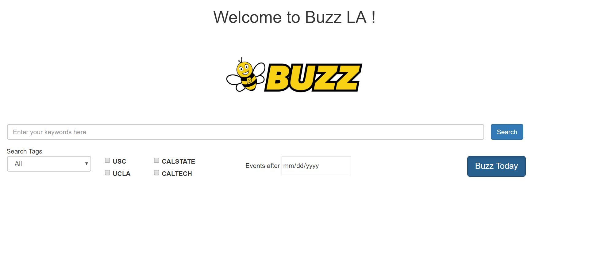
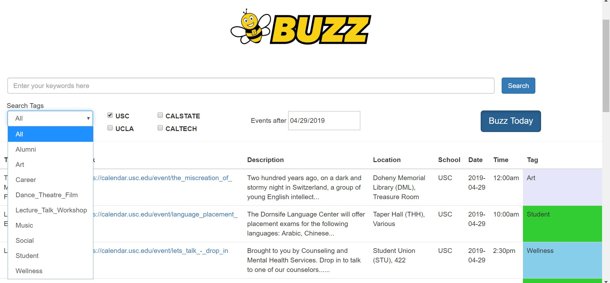
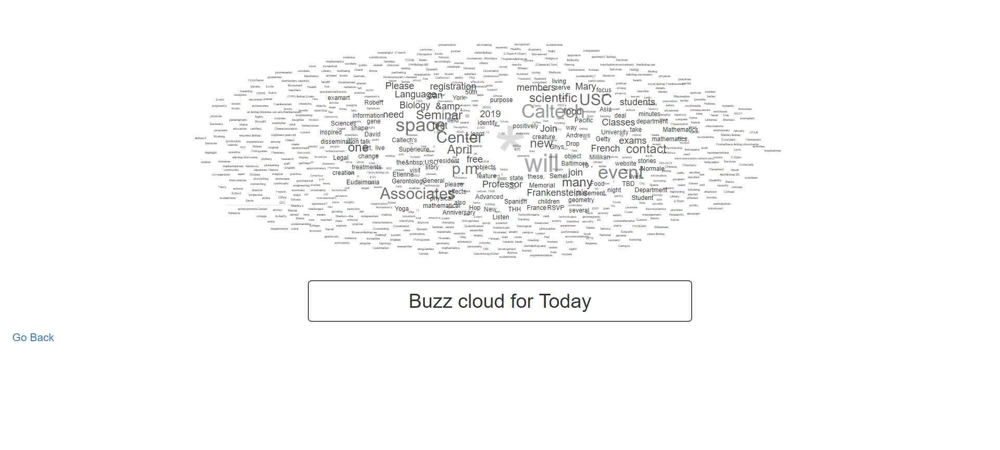
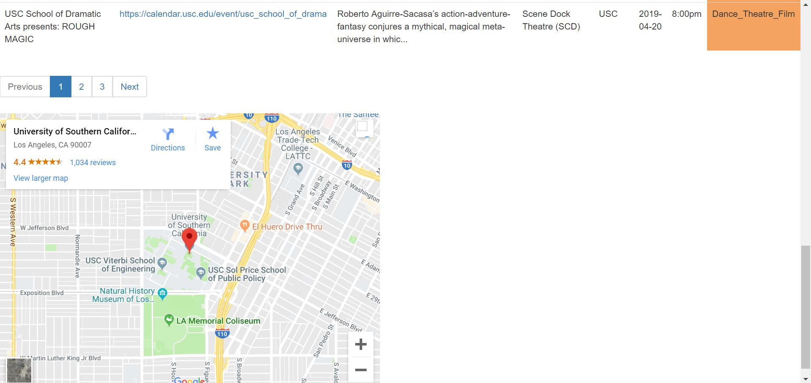

# buzz_la

Buzz LA is a knowledge graph that provides users (students, faculty) with information about events at Universities in the city of Los Angeles. Users are  able to search for events related to  academics, sports, workshops etc. This application utilized 1200+ scraped events with the help of scrapers, entity linking methods and elasticsearch database to query the results to a web application.

**Language:** python

**Authors:**

- [Chukwudubem Nwoji](https://github.com/Chukudubem)
- [Nikhit Mago](https://github.com/nikhitmago)
- [Tanay Shankar](https://github.com/tanaysh7)

**Requirements:**

- node package manager (npm)

- Elasticsearch 7.0.0

**Installation:**

- npm install `(in buzz_es directory)`

- curl -X PUT 'localhost:9200/event?pretty' `(create index called "event")`

- curl -X POST 'http://localhost:9200/event/events/_bulk?pretty' -H 'Content-Type: application/json' --data-binary '@final_data.json' `(Load final_data.json to elasticsearch using this command)`

**Execution:**

npm start `(in buzz_es directory)`

April 2019

